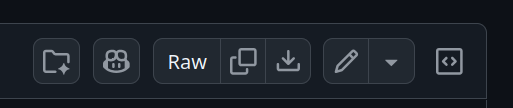

# Sotto La Luna

## Istruzioni per il cliente

Ogni istruzione sottostante prevede che il cliente si rechi al link di [GitHub](https://github.com/SebaOfficial/SottoLaLuna)

### Modificare il menù

Per modificare il menù è necessario recarsi nella cartella [src/lib/assets](./src/lib/assets/), nominare il file `menu.pdf` e segiure le istruzioni per [fare l'upload di un file](#fare-lupload-di-un-file).

### Modificare i testi

Per modificare i testi presenti sul sito è necessario modificare il file [`src/src/lib/i18n/it.toml`](./src/lib/i18n/it.toml).
Leggere i commenti (prefissi da un `#`) per sapere ciò che rappresentano.

#### Come modificare un file

Una volta individuato il file testuale da modificare è necessario schiacciare sull'icona :pencil2: come in figura sottostante:

_Non ti mostra l'icona per modificare il file? controlla [qui](#non-mi-mostra-licona-per-modificare)_

Dopodichè basta apportare le modifiche al file e salvarlo schiacciando su "Commit Changes" (il pulsante verde).

Per finalizzare le modifiche è necessario un ["Commit message"](#aggiungere-un-messaggio-di-commit)

##### Non mi mostra l'icona per modificare

Se non viene mostrata l'icona per modificare il file è necessario controllare di essere loggati su GitHub, dopodichè, se ancora non funziona è consigliato contattare lo sviluppatore secondo le modalità concordate.

### Modificare le immagini

Per modificare le immagini presenti sul sito seguire la seguente legenda con le istruzioni per [fare l'upload di un file](#fare-lupload-di-un-file):

| Nome File                                     | Cartella                                          | Descrizione                                                  |
| --------------------------------------------- | ------------------------------------------------- | ------------------------------------------------------------ |
| [favicon.png](./src/lib/assets/favicon.png)   | [src/lib/assets/](./src/lib/assets/)              | L'immagine mostrata di fianco al nome del sito.              |
| [hero.jpg](./src/lib/assets/hero.jpg)         | [src/lib/assets/](./src/lib/assets/)              | La prima immagine che si vede quando viene aperto il sito.   |
| [og-image.jpg](./src/lib/assets/og-image.jpg) | [src/lib/assets/](./src/lib/assets/)              | Immagine usata come preview sui social.                      |
| [about/\*](./src/lib/assets/about/)           | [src/lib/assets/about](./src/lib/assets/about/)   | Immagini che si trovano nel carosello della sezione about.   |
| [menu/\*.jpg](./src/lib/assets/menu/)         | [src/lib/assets/menu](./src/lib/assets/menu/)     | Immagini che rappresentano l'`n`esimo elemento del menù.     |
| [cellar/\*.jpg](./src/lib/assets/cellar/)     | [src/lib/assets/cellar](./src/lib/assets/cellar/) | Immagini che si trovano nel carosello della sezione camtina. |

### Fare l'upload di un file

Per modificare un file seguire i seguenti passaggi:

1. Recarsi nella cartella indicata
2. Assicurarsi che il file da caricare abbia lo stesso nome indicato
3. Schiacciare su "Add file", come in figura:
   
4. Schiacciare su "Upload files" e scegliere il file corretto (anche più di uno).
5. Scrivere qualcosa in ["Commit Changes"](#aggiungere-un-messaggio-di-commit)

### Aggiungere un messaggio di commit

Per finalizzare le modifiche è necessario scrivere una descrizione significativa di ciò che è stato cambiato, il così detto "Commit message".
Nota che GitHub mostrerà in automatico ciò che pensa sia stato modificato/caricato.

È a discrezione del cliente scegliere se modificare il messaggio di Commit o lasciare quello proposto da GitHub.

> [!NOTE]
> Il messaggio di commit non influisce in alcun modo con il sito web, serve solo a tenere traccia dei cambiamenti effettuati.

## Crediti

Questo sito è stato sviluppato da [Sebastiano Racca](https://racca.me) per conto del ristorante ["Sotto La Luna"](https://sottolaluna.it).

## Licenza

Questo progetto non è open source.
Il codice è pubblicato esclusivamente a fini dimostrativi e di portfolio.
Consultare il file [LICENSE](./LICENSE) per i termini completi.
